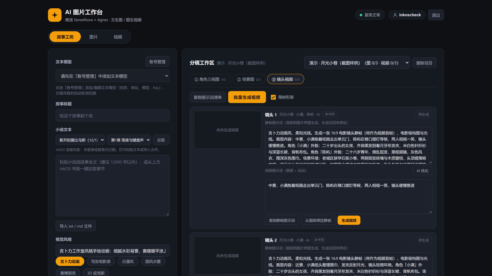
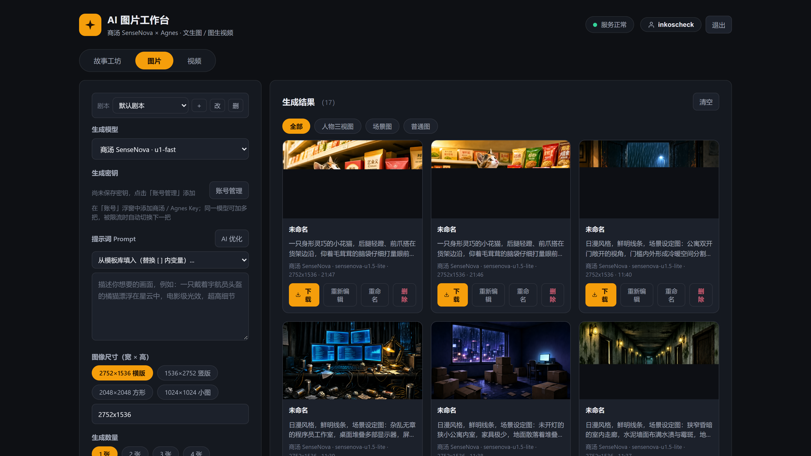
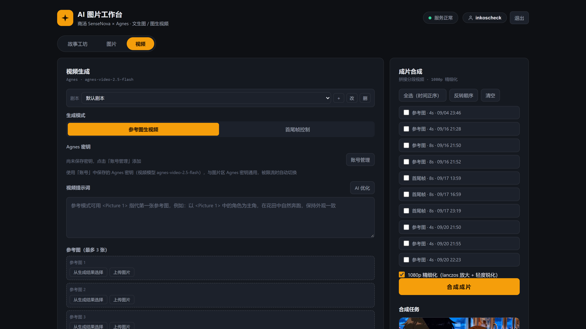
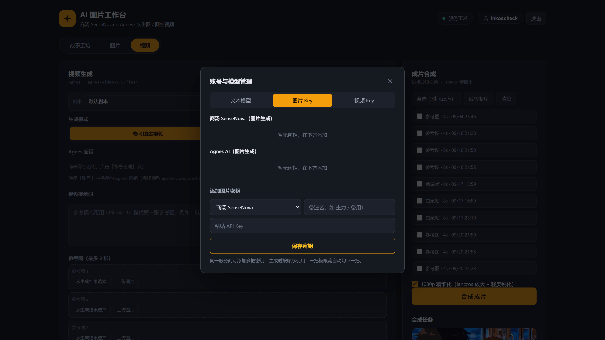

# AI Image Studio (AI 影像工作台)

[简体中文](README.md) | English

A self-hosted AI visual creation studio: text-to-image, image-to-video, three-step story-to-film production, and final video composition — all running on your own machine. API keys are provided by the user; no secrets are bundled with the server.

 

## Screenshots

| Story Workshop | Image Studio |
|---|---|
|  |  |
| **Video Studio** | **Account & Model Management** |
|  |  |

## Features

### Image Generation
- **SenseNova** (`sensenova-u1-fast` / `sensenova-u1.5-lite`): pixel-exact sizes (default 2752x1536), 1–4 images in parallel, optional watermark
- **Agnes** (`agnes-image-2.5-flash`): 1K/2K/4K resolution plus any aspect ratio
- Generation history persisted on disk, with download / full-size preview

### Video Generation
- **Agnes** (`agnes-video-2.5-flash`), two modes:
  - **Reference-to-video**: up to 3 reference images, addressed as `<Picture 1>` in the prompt
  - **First/last frame control**: smooth camera transition between two frames
- Pick reference assets directly from generation results or video last frames
- Async tasks polled automatically, results saved to disk

### Story Workshop (novel → film)
1. **Smart storyboarding**: paste novel text (or pull a chapter from InkOS in one click); the text model produces character cards, scene cards, and a shot list
2. **Character sheets**: front/side/back turnaround sheet per character
3. **Scene images**: one environment-only establishing image per scene
4. **Per-shot videos**: mode auto-selection — shots entering a new scene use "character sheet + scene image" as references; shots continuing a scene chain from the previous video's last frame
5. **Final composition**: stitch clips into a full film (ffmpeg), 720P / 1080P

### More
- **Centralized account key management**: click the account chip to open a popover managing text models (multiple OpenAI-compatible configs), image keys (SenseNova / Agnes), and video keys (Agnes)
- **Multi-key automatic failover**: save multiple keys per provider; a rate-limited / exhausted / invalid key automatically rotates to the next one, with toast notifications and per-key error summaries when all fail
- Text model configs: multiple OpenAI-compatible endpoints (DeepSeek / GLM / Kimi, etc.) for storyboarding, with automatic round-robin
- **Local image upload**: drag-and-drop or file-picker upload into reference / frame slots
- **Result management**: filter results by type (character sheet / scene / general), rename, delete, re-edit back into the prompt
- **AI prompt optimization**: one-click prompt enhancement via [prompt-optimizer](https://github.com/linshenkx/prompt-optimizer) (works for image / video / shot prompts)
- **InkOS integration**: once a local [InkOS](https://github.com/czstudio/inkos_studio) service is detected, pick a book and chapter from the shelf and pull chapter text plus the character matrix (for character consistency)

## Quick Start

### Option 1: Docker Compose (recommended)

```bash
git clone https://github.com/xuanduo-077/ai-image-studio.git
cd ai-image-studio
docker compose up -d --build
```

Open `http://localhost:8787` and register an account.

### Option 2: Run from source

```bash
git clone https://github.com/xuanduo-077/ai-image-studio.git
cd ai-image-studio
npm install
npm start
```

Requires Node.js >= 18.

## Environment Variables

| Variable | Default | Description |
|---|---|---|
| `PORT` | `3000` | Server listen port |
| `INKOS_BASE` | `http://127.0.0.1:4567` | InkOS service address; when unset it auto-detects candidates (loopback → docker gateway → host.docker.internal) |
| `OPTIMIZER_URL` | `http://127.0.0.1:28081` | prompt-optimizer service address (for AI prompt optimization; ignore if not deployed) |
| `OPTIMIZER_USER` / `OPTIMIZER_PASS` | `admin` / `123456` | prompt-optimizer access credentials (its `ACCESS_USERNAME` / `ACCESS_PASSWORD`) |

## API Keys

| Provider | Purpose | How to get |
|---|---|---|
| SenseNova | Image generation | Create an API key in the [sensecore console](https://console.sensecore.cn/) |
| Agnes | Image / video generation | Get one from the [agnes-ai.cn](https://www.agnes-ai.cn/) platform |
| Text model | Storyboarding | Any OpenAI-compatible endpoint (DeepSeek / GLM / Kimi, etc.) — fill baseUrl and key in "Model Management" |

Keys can be used in two ways:
- **Save to your account** (recommended): stored server-side in `data/db.json`, shared across devices, multiple keys per provider
- **Paste temporarily**: kept only in browser localStorage

## Final Composition: ffmpeg

The composition feature needs a static ffmpeg build. If missing, the UI will tell you on first use.

```bash
# Linux (amd64)
mkdir -p data/bin
curl -L https://johnvansickle.com/ffmpeg/releases/ffmpeg-release-amd64-static.tar.xz \
  | tar -xJ --strip-components=1 -C data/bin --wildcards '*/ffmpeg' '*/ffprobe'
```

Windows: download the essentials build from [gyan.dev](https://www.gyan.dev/ffmpeg/builds/) and put `ffmpeg.exe` / `ffprobe.exe` into `data/bin/`.

## InkOS Integration (optional)

[InkOS](https://github.com/czstudio/inkos_studio) is an open-source AI novel-writing agent. Once deployed (default port 4567), an InkOS shelf appears in the Story Workshop:

1. Pick a book → pick a chapter (review status and word count shown)
2. "Pull" fills in the chapter text and attaches the InkOS character matrix (`truth/character_matrix.md`) as the character reference
3. Chapters in "approved / ready-for-review" status are recommended

If InkOS runs at a different address, set `INKOS_BASE`.

## Prompt Optimizer Integration (optional)

Deploy [prompt-optimizer](https://github.com/linshenkx/prompt-optimizer) (all-in-one Docker image with a built-in MCP service), and "AI Optimize" buttons appear next to image / video / shot prompts, expanding a rough description into a professional one:

```bash
docker run -d -p 28081:80 \
  -e ACCESS_USERNAME=admin \
  -e ACCESS_PASSWORD=your_password \
  -e MCP_DEFAULT_MODEL_PROVIDER=custom \
  -e VITE_CUSTOM_API_KEY=your_text_model_key \
  -e VITE_CUSTOM_API_BASE_URL=https://api.deepseek.com/v1 \
  -e VITE_CUSTOM_API_MODEL=deepseek-chat \
  --restart unless-stopped \
  --name prompt-optimizer \
  linshen/prompt-optimizer
```

Each optimization consumes the text model's quota (roughly one LLM call). If not at the default address, set `OPTIMIZER_URL` / `OPTIMIZER_USER` / `OPTIMIZER_PASS`.

> Advanced: every environment variable can also be overridden via `data/config.json` (a key-value object, e.g. `{"OPTIMIZER_URL": "http://192.168.1.10:28081"}`) — handy when you cannot set container environment variables. The file lives under `data/` and is never committed.

## Security Notes

- API keys and text-model keys in `data/db.json` are **stored in plaintext** (required for server-side model calls) — make sure the host is trusted
- Registration is open; do not expose the service directly to the public internet. If you must, add a reverse proxy with HTTPS and access control
- All generation records are stored under `data/`; deleting a project does not delete generated media — clean `data/files/` manually from time to time

## Project Layout

```
├── server.js          # Express backend (API proxying, accounts, story, composition)
├── public/            # Frontend (vanilla HTML/CSS/JS, no build step)
│   ├── index.html     # Image / video workspaces
│   ├── app.js
│   ├── story.js       # Story Workshop
│   └── style.css
├── data/              # Runtime data (not committed): db.json, history.json, files/, stories/, bin/
├── Dockerfile
└── docker-compose.yml
```

## Updating

Restart the container / process after code updates (the only dependency is express):

```bash
docker compose up -d --build
```

## Changelog

### v2.0.0
- Centralized account management: text models, image keys, and video keys managed in one popover; workspaces switch to dropdowns
- Multi-key automatic failover with toast notifications and key health badges
- Story Workshop rebuilt as three-step production: character sheets → scene images → per-shot videos (reference mode on scene change, last-frame chaining otherwise)
- Deep InkOS integration: book/chapter shelf, one-click text + character matrix pull
- Image workspace upgrade: generation types, result filters, rename, delete, re-edit, local drag-drop upload
- AI prompt optimization via prompt-optimizer (MCP)
- History is append-only (no auto deletion), isolated per script/project
- Fixes: history clear not deleting files; missing scriptId hiding generation results

### v1.0.0
- First open-source release: text-to-image, image-to-video, story storyboarding, final composition, account system

## License

[MIT](LICENSE)
